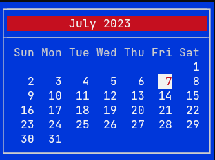

# Calendar

A program to display a calendar in a terminal using `ncurses`. 

* `Up`/`Down` arrows move forward/backward by one month.
* `Pgup`/`Pgdn` move forward/backward by one year.
* `Home` displays current month/year.

Copyright (c) 2023 Paul Sobolik

[MIT license](LICENSE)